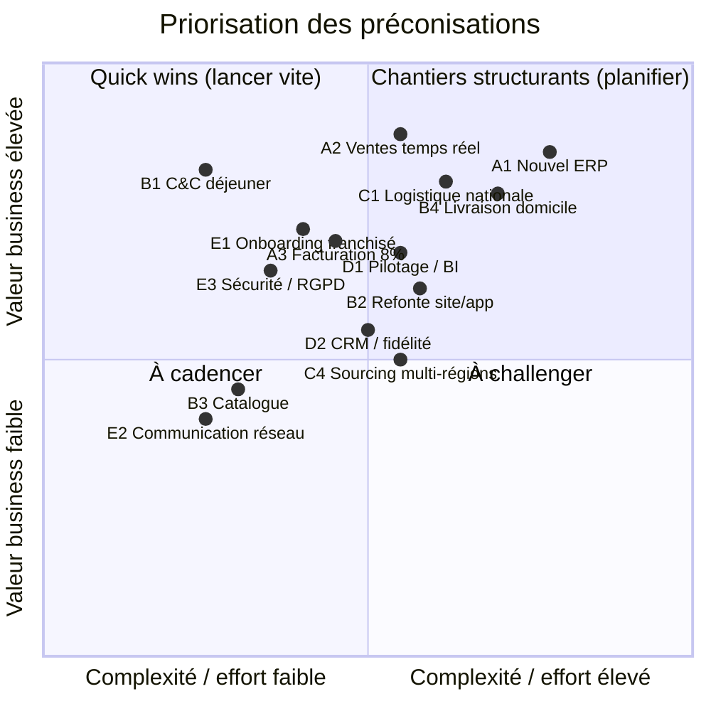

# Préconisations et priorités — Transformation du SI : M. Traiteur

> **Commanditaire** : Direction M. Traiteur (M. Traiteur père & fils)
> **Maîtrise d'ouvrage déléguée / AMOA** : équipe projet SI
> **Objet** : Préconisations d'évolution du SI et priorisation, à l'appui de la stratégie d'extension du réseau
> **Version** : 1.0 — document de cadrage

---

## 1. Démarche

Ces préconisations traduisent le diagnostic (cartographie de l'existant, analyse SWOT, analyse des processus, analyse des risques) en **évolutions concrètes**, chacune :

- rattachée à un ou plusieurs des **objectifs stratégiques** de la direction,
- justifiée par une **friction** identifiée (processus à améliorer `PA-xx` ou manquant `PM-xx`),
- couverte par une **mesure de maîtrise du risque**,
- positionnée dans une **priorité** (P1 / P2 / P3) puis ordonnancée dans le schéma directeur.

Rappel des objectifs servis :

| N° | Objectif |
|---|---|
| O1 | Doubler le CA |
| O2 | Étendre le réseau à d'autres régions |
| O3 | Remplacer l'ERP |
| O4 | Mettre en place la livraison à domicile (<10 pers., en semaine) |
| O5 | Indexer les frais de gestion sur le CA (8 %) |
| O6 | Assouplir le click & collect (ventes déjeuner) |
| O7 | Revoir la logistique (couverture hors région) |

---

## 2. Principes directeurs

Avant le détail, cinq principes encadrent **toutes** les préconisations :

1. **Découplage des domaines** — les règles métier (commande, franchise, supply chain, facturation) sont indépendantes des outils. Un changement de prestataire (ERP, logisticien, transporteur) ne doit pas remettre en cause les processus → **interfaces / API clairement définies** entre domaines.
2. **Source unique de vérité** — pas de duplication de données entre ERP et caisse ; le CA, le catalogue et les référentiels franchisés ont chacun un propriétaire unique.
3. **Temps quasi réel sur les flux critiques** — sortie du batch nocturne pour les ventes (effet de levier sur le pilotage et la facturation au % du CA).
4. **Sécurité & RGPD by design** — droits par rôle (franchisé / siège / acheteur), chiffrement des flux, dès la conception, pas en fin de parcours.
5. **Évolution progressive, pas rupture** — remplacement par étapes et coexistence temporaire de l'ancien et du nouveau (ERP, logistique).

---

## 3. Préconisations par domaine

### Domaine A — Socle de gestion (ERP & finance)

| Réf. | Préconisation | Frictions levées | Objectifs | Risque maîtrisé |
|---|---|---|---|---|
| A1 | Remplacer l'ERP infogéré par une solution moderne **SaaS, API-first**, à coût maîtrisé | dépendance éditeur stagnant | O3 | Migration ERP : perte de données, interruption d'activité — 🔴 Critique |
| A2 | Mettre en place la **remontée des ventes en temps quasi réel** (caisse → socle) | PA-01 | O1 | Incompatibilité ERP / caisses — 🟠 Important |
| A3 | Industrialiser le **calcul et la facturation des frais au 8 % du CA** (franchisés uniquement) | PA-05, PM-08 | O5, O1 | Erreurs de calcul ou fraude sur déclaration du CA — 🟠 Important |
| A4 | **Différencier la gestion magasins propres / franchisés** (droits, facturation) | PM-08 | O1, O5 | Erreurs de périmètre gestion / facturation — 🟠 Important |

> A2 est le **prérequis** de A3 (facturation indexée) et du pilotage consolidé (domaine D) : un CA fiable et récent conditionne les deux.

### Domaine B — Services numériques clients

| Réf. | Préconisation | Frictions levées | Objectifs | Risque maîtrisé |
|---|---|---|---|---|
| B1 | **Click & collect accéléré** : assouplir le délai (3h → <1h) et fluidifier le parcours déjeuner | PA-02, PM-05 | O6, O1 | Mauvaise estimation des délais de préparation — 🟠 Important |
| B2 | **Refondre le site web et l'application** (commande, paiement, parcours) | PM-02 | O1, O6 | Dysfonctionnements lors de la mise en production — 🟠 Important |
| B3 | Gérer et **publier le catalogue (~30 plats en rotation)** depuis une source unique | PM-02 | O6, O1 | Incohérence carte / offre |
| B4 | Mettre en place la **livraison à domicile** (<10 pers., en semaine) | PA-03, PM-04 | O4, O1 | Retards ou erreurs de livraison — 🟠 Important |

> B1 est un **quick win** : il dépend du site/app et de l'assouplissement des règles, **pas** du nouvel ERP complet. À lancer tôt pour générer du CA sans attendre le socle.

### Domaine C — Logistique & supply chain

| Réf. | Préconisation | Frictions levées | Objectifs | Risque maîtrisé |
|---|---|---|---|---|
| C1 | Sélectionner un **partenaire logistique à couverture nationale** | PA-04, PM-07 | O7, O2 | Incapacité du prestataire à couvrir les nouvelles régions — 🔴 Critique |
| C2 | Ouvrir le SI à une **gestion multi-prestataires** (interface logistique standardisée) | PM-07, PM-03 | O7, O2 | Dépendance à un prestataire unique — 🟠 Important |
| C3 | Gérer la **coexistence « Je livre » → partenaire national** sans rupture de supply chain | PA-04 | O7 | Rupture de supply chain lors de la transition — 🟠 Important |
| C4 | Étendre le **sourcing producteurs multi-régions** (produits/plats locaux) | PA-06 | O2 | Difficulté d'intégration des nouvelles franchises — 🟠 Important |

### Domaine D — Pilotage & relation client

| Réf. | Préconisation | Frictions levées | Objectifs | Risque maîtrisé |
|---|---|---|---|---|
| D1 | Mettre en place un **pilotage consolidé / tableaux de bord** (ventes, stocks, perf. par franchisé) | PM-06 | O1, O2 | Pilotage aveugle (moyen) |
| D2 | Déployer un **CRM et un programme de fidélité** (exploitation des données clients) | PM-06 | O1 | Non-respect du RGPD — 🔴 Critique |

### Domaine E — Extension du réseau & gouvernance

| Réf. | Préconisation | Frictions levées | Objectifs | Risque maîtrisé |
|---|---|---|---|---|
| E1 | Industrialiser l'**onboarding SI d'un nouveau franchisé** (kit de déploiement standardisé) | PM-01 | O2 | Difficulté d'intégration des nouvelles franchises — 🟠 Important |
| E2 | Formaliser la **communication structurée siège ↔ franchisés** | PM-09 | transverse | Résistance au changement des franchisés — 🟡 Modéré |
| E3 | **Sécurité & RGPD** : droits par rôle, MFA, sauvegardes, PRA | — | transverse | Cyberattaque / fuite de données clients — 🔴 Critique |
| E4 | **Conduite du changement** continue à chaque déploiement | — | transverse | Résistance au changement des franchisés — 🟡 Modéré |

---

## 4. Matrice de priorisation (valeur business × complexité)

---

## 5. Synthèse priorisée

### Priorité 1 — fondations & quick wins (engager en premier)

| Réf. | Préconisation | Justification de priorité |
|---|---|---|
| B1 | Click & collect accéléré | Quick win à fort ROI (ventes déjeuner), indépendant du socle ERP |
| A1 | Remplacement de l'ERP | Prérequis technique de la modernisation et du temps réel |
| A2 | Ventes en temps quasi réel | Effet de levier sur la facturation 8 % et le pilotage |
| C1 | Partenaire logistique national | Lève le verrou structurel à l'extension hors région |
| E3 | Sécurité & RGPD by design | Transverse, doit démarrer dès la conception du socle |

### Priorité 2 — relais de croissance & pilotage

| Réf. | Préconisation |
|---|---|
| A3 | Facturation indexée au 8 % du CA |
| B2 / B3 | Refonte site/app + gestion du catalogue |
| B4 | Livraison à domicile |
| C2 / C3 | Gestion multi-prestataires + coexistence « Je livre » |
| D1 | Pilotage consolidé / tableaux de bord |
| E1 | Onboarding SI des nouveaux franchisés |

### Priorité 3 — consolidation & extension

| Réf. | Préconisation |
|---|---|
| D2 | CRM & fidélité |
| C4 | Sourcing producteurs multi-régions |
| A4 | Différenciation magasins propres / franchisés |
| E2 | Communication structurée siège ↔ franchisés |

---

## 6. Articulation avec le schéma directeur

Cette priorisation alimente directement la feuille de route à 5 ans : les préconisations **P1** constituent les lots de l'année 1 (socle ERP, quick win click & collect, lancement logistique, sécurité), les **P2** portent les relais de croissance (années 2-3) et les **P3** la consolidation et l'extension nationale (années 4-5). Le détail temporel, les dépendances et les jalons sont précisés dans le schéma directeur du SI.
