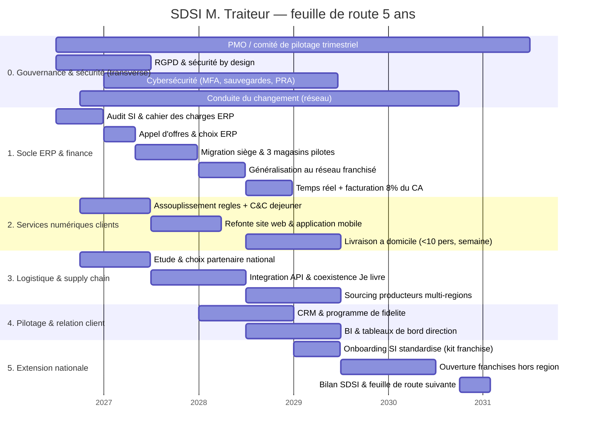

# Schéma directeur du SI (SDSI) — 5 ans : M. Traiteur

> **Commanditaire** : Direction M. Traiteur (M. Traiteur père & fils)
> **Maîtrise d'ouvrage déléguée / AMOA** : équipe projet SI
> **Objet** : Feuille de route de transformation du SI à l'appui de la stratégie d'extension du réseau
> **Horizon** : A1 → A5, aligné sur l'échéance de **reprise / succession (fin A5)**
> **Version** : 1.0 — document de cadrage

---

## 1. Principes directeurs

Le SDSI traduit la stratégie (doubler le CA, étendre le réseau hors région, moderniser le SI) en une feuille de route. Il s'appuie sur cinq principes :

1. **Le socle d'abord, mais pas seul** — l'ERP est le prérequis du pilotage et de la facturation, mais les **quick wins** (Click & Collect déjeuner, sécurité) tournent **en parallèle** pour générer de la valeur tôt.
2. **Sécurité & RGPD by design, dès A1** — chantier **transverse**, pas une phase finale.
3. **Migration progressive et coexistence** — ERP et logistique migrent par étapes (siège → pilotes → réseau), l'ancien et le nouveau cohabitent le temps de la bascule (pas de rupture).
4. **Conduite du changement continue** — formation et accompagnement des franchisés à chaque déploiement (menace n°1 de la SWOT).
5. **Domaines fonctionnels étanches** — un changement de prestataire (ERP, logisticien) ne doit pas remettre en cause les processus : interfaces (API) clairement définies entre domaines.

---

## 2. Vue d'ensemble — feuille de route (Gantt)

---

## 3. Détail des lots, dépendances et jalons

| Lot | Période | Objectif stratégique servi | Dépendances | Jalon clé |
|---|---|---|---|---|
| **0. Gouvernance & sécurité** | A1 → A5 | Maîtrise des risques, RGPD, adoption | — | Comité de pilotage opérationnel (A1) ; PRA testé (A2) |
| **1.1 Audit + cahier des charges ERP** | A1 | Changer d'ERP | — | CDC validé |
| **1.2 Choix ERP** | A1 | Changer d'ERP | 1.1 | Contrat signé |
| **1.3 Migration siège + pilotes** | A1-A2 | Moderniser le SI | 1.2 | Siège + 3 magasins en prod |
| **1.4 Généralisation réseau** | A2 | Homogénéité réseau | 1.3 | 25 franchisés migrés |
| **1.5 Temps réel + facturation 8 %** | A2-A3 | **Indexer frais à 8 % du CA**, pilotage | 1.4 | 1ʳᵉ facturation indexée |
| **2.1 Quick win C&C déjeuner** | A1-A2 | Ventes déjeuner, C&C accéléré (<1h) | site/app + règles | C&C <1h actif |
| **2.2 Refonte site/app** | A2-A3 | Expérience client | 2.1 | Nouvelle plateforme |
| **2.3 Livraison à domicile** | A3-A4 | **Livraison <10 pers. en semaine** | 2.2 + 3.2 | Livraison de proximité active |
| **3.1 Choix partenaire national** | A1-A2 | Logistique hors région | — (parallèle ERP) | Contrat logistique |
| **3.2 Intégration + coexistence Je livre** | A2-A3 | Continuité supply chain | 3.1 | Bascule sans rupture |
| **3.3 Sourcing multi-régions** | A3 | Produits/plats locaux | 3.1 | Producteurs hors région intégrés |
| **4.1 CRM & fidélité** | A3 | Données clients, marketing | 1.5 | CRM opérationnel |
| **4.2 BI & tableaux de bord** | A3-A4 | Pilotage temps réel direction | 1.5 | Cockpit direction |
| **5.1 Onboarding SI standardisé** | A4 | Scalabilité du réseau | 1.4, 2.2 | Kit de déploiement franchise |
| **5.2 Ouverture hors région** | A4-A5 | **Étendre le réseau** | 5.1, 3.x | 1ʳᵉˢ franchises hors région |
| **5.3 Bilan SDSI** | A5 | Préparer la reprise | tous | Rapport + jalon succession |

> **Note de séquençage** : les lots **2.1 (Click & Collect)**, **3.1 (logistique)** et **0 (sécurité)** démarrent **en parallèle** du chantier ERP afin de (a) capter du CA tôt, (b) absorber le délai contractuel long du logisticien, (c) ne pas reporter la sécurité. Cela réduit aussi le risque de glissement global si l'ERP prend du retard (menace SWOT).

---

## 4. Vue annuelle synthétique

| Lot \ Année | A1 | A2 | A3 | A4 | A5 |
|---|:--:|:--:|:--:|:--:|:--:|
| Gouvernance & sécurité | ███ | ███ | ███ | ███ | ███ |
| Socle ERP & finance | ███ | ███ | █░░ | | |
| Facturation 8 % / temps réel | | ░██ | █░░ | | |
| C&C déjeuner (quick win) | ░██ | █░░ | | | |
| Refonte site/app | | ░██ | ██░ | | |
| Livraison à domicile | | | ░██ | ██░ | |
| Logistique nationale | ░██ | ███ | ██░ | | |
| CRM & fidélité | | | ███ | █░░ | |
| BI & tableaux de bord | | | ░██ | ██░ | |
| Extension hors région | | | | ░██ | ███ |

**Légende** : `███` phase principale · `██` poursuite · `░` préparation / finalisation.

---

## 5. Gouvernance & indicateurs de pilotage

- **Comité de pilotage trimestriel** (direction père/fils + AMOA) : revue d'avancement, arbitrage budget, gestion des risques.
- **Jalons annuels (go/no-go)** conditionnant le lancement du lot suivant.
- **Jalon pivot A5** : transmission au fils alignée sur la fin du SDSI.
- **KPI de suivi** (cibles indicatives, à confirmer) :
  - % de franchisés migrés sur le nouvel ERP ;
  - délai de remontée des ventes (batch nocturne → **< 5 min** en temps réel) ;
  - part du CA « déjeuner » (objectif : **> 10 %** grâce au C&C rapide) ;
  - nombre de franchises hors région ouvertes ;
  - **progression du CA vs objectif x2** ;
  - taux d'adoption des nouveaux outils par les franchisés.

---

## 6. Cadre budgétaire

Le SDSI engage deux natures de coûts à arbitrer en comité de pilotage :

- **Investissement (CAPEX)** : licences/intégration nouvel ERP, refonte site/app, développement livraison & CRM/BI, kit d'onboarding.
- **Fonctionnement (OPEX)** : abonnement ERP cible (vs 16 000 €/an actuel), prestataire logistique national (vs 150 000 €/an « Je livre »), hébergement, maintenance.

> Le chiffrage détaillé et le ROI sont instruits dans le dossier financier dédié. Principe retenu à ce stade : l'OPEX du socle doit baisser ou rester stable, l'investissement étant gagé sur la croissance du CA (extension + nouveaux services).
