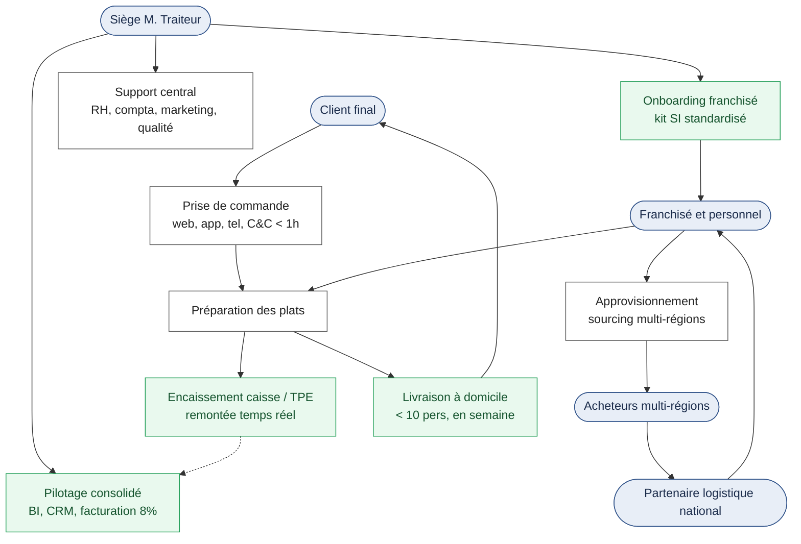
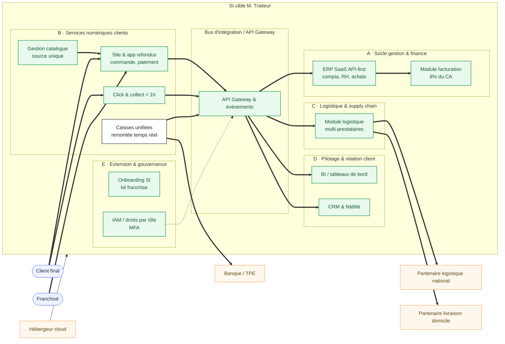

# Cartographie cible du SI (to be) — M. Traiteur

> **Commanditaire** : Direction M. Traiteur (M. Traiteur père & fils)
> **Maîtrise d'ouvrage déléguée / AMOA** : équipe projet SI
> **Objet** : Cartographie du SI à l'état cible, à l'appui de la stratégie d'extension du réseau
> **Version** : 1.0 — document de cadrage

---

## 1. Objectif et périmètre

Cette cartographie décrit le SI **à l'état envisagé** (cible), tel qu'il doit soutenir le doublement du CA, l'extension hors région et les nouveaux services clients. Elle prolonge la cartographie de l'existant (as-is) et s'organise selon les quatre couches d'urbanisation : **métier, fonctionnelle, applicative, technique**.

Le principe directeur est le **découplage des domaines** : chaque domaine (socle de gestion, services clients, logistique, pilotage, extension) expose des **interfaces / API** stables, de sorte qu'un changement de prestataire ou d'outil ne remette pas en cause les processus.

---

## 2. Légende des flux

| Type de trait | Signification |
|---|---|
| Trait plein épais | Flux applicatif **temps quasi réel** (API / événementiel) |
| Trait pointillé | Flux différé ou périodique (consolidation, reporting) |
| Trait plein orange | Relation contractuelle (hébergement, infogérance, partenariat logistique) |
| Trait plein fin | Flux physique (livraison, retrait, livraison à domicile) |

---

## 3. Couche métier (processus cible)

Nouveaux processus (en vert) introduits par la cible : **encaissement temps réel**, **livraison à domicile de proximité**, **pilotage consolidé (BI/CRM + facturation 8 %)** et **onboarding SI standardisé** des franchisés.

---

## 4. Couche fonctionnelle & applicative (domaines cibles)

### Lecture des domaines cibles

| Domaine | Composants cibles | Évolution vs as-is |
|---|---|---|
| **A — Socle gestion & finance** | ERP SaaS API-first, module facturation 8 % | Remplacement de l'ERP infogéré ; nouvelle facturation indexée |
| **B — Services numériques clients** | Site/app refondus, gestion catalogue, C&C < 1 h, caisses temps réel | Refonte ; sortie du batch ; nouveau C&C accéléré |
| **C — Logistique & supply chain** | Module logistique multi-prestataires | Sortie du mono-prestataire « Je livre » ; ouverture nationale |
| **D — Pilotage & relation client** | BI, CRM & fidélité | Création (inexistant en as-is) |
| **E — Extension & gouvernance** | Onboarding SI, IAM/MFA, droits par rôle | Industrialisation et sécurisation |
| **Intégration** | API Gateway / bus d'événements | Découplage généralisé entre domaines |

---

## 5. Couche technique (infrastructure cible)

| Composant | Hébergement / infrastructure cible |
|---|---|
| ERP | SaaS, hébergé par l'éditeur, exposé via API |
| Site / app | Hébergement cloud mutualisé, dimensionnement élastique |
| Caisses | Équipements locaux conservés, synchronisation temps réel via le bus |
| Intégration | API Gateway + bus d'événements (temps quasi réel) |
| Sécurité | IAM centralisé, MFA, chiffrement des flux, sauvegardes, PRA/PCA |
| Données | Source unique par référentiel (CA, catalogue, franchisés) |

---

## 6. Synthèse — du as-is au to-be

La cible lève les quatre verrous du SI actuel :

1. **Batch → temps réel** : les ventes remontent en continu, condition du pilotage et de la facturation 8 %.
2. **Dépendances externes → interfaces ouvertes** : ERP SaaS API-first et logistique multi-prestataires réduisent l'effet de verrouillage.
3. **Services absents → domaines dédiés** : livraison à domicile, click & collect accéléré, BI et CRM existent comme domaines à part entière.
4. **Réseau régional → extension industrialisée** : onboarding SI standardisé et sécurité by design rendent l'ouverture hors région réplicable.

> Cette cartographie cible est l'aboutissement de la feuille de route à 5 ans (schéma directeur). Les jalons, dépendances et risques associés sont détaillés dans les dossiers correspondants.
