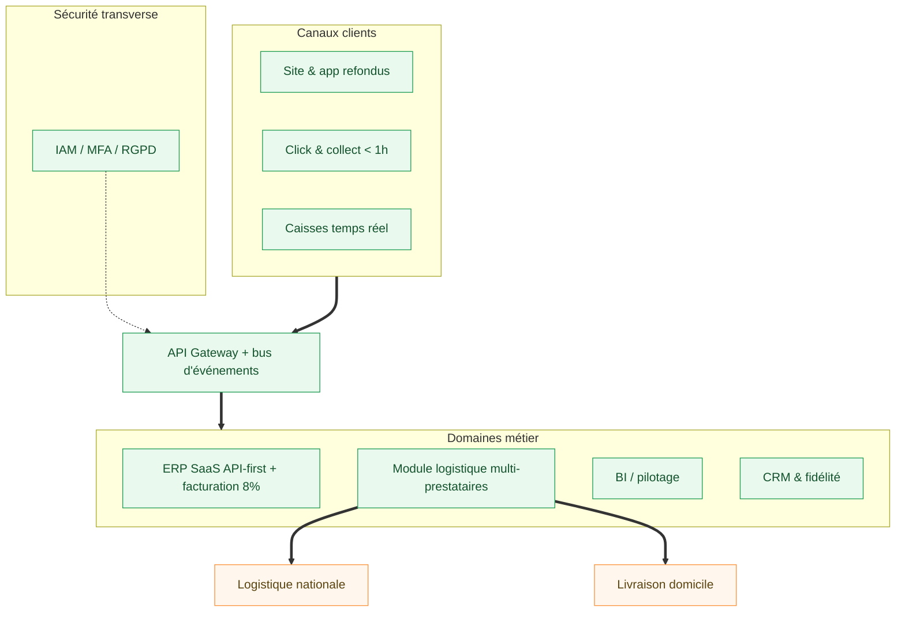
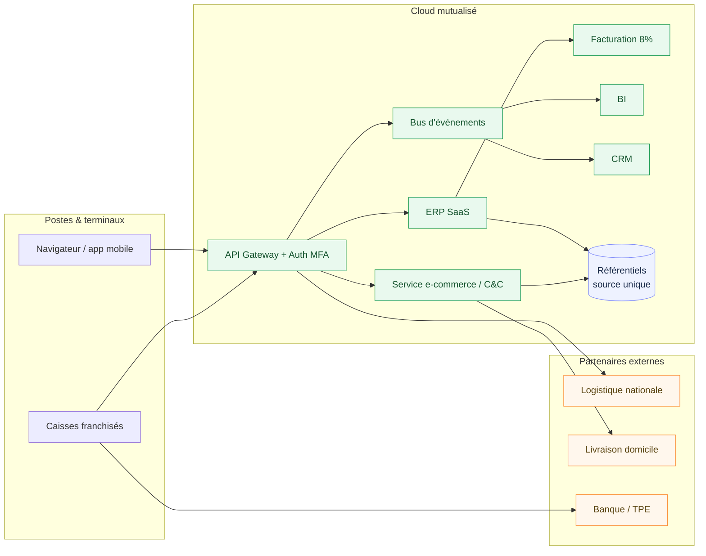

# Préconisations architecturales — SI cible : M. Traiteur

> **Commanditaire** : Direction M. Traiteur (M. Traiteur père & fils)
> **Maîtrise d'ouvrage déléguée / AMOA** : équipe projet SI
> **Objet** : Recommandations d'architecture pour les évolutions prioritaires (choix technologiques, justification, schéma cible)
> **Version** : 1.0 — document de cadrage

---

## 1. Style d'architecture retenu

L'architecture cible suit un **modèle orienté services, découplé par API**, avec un **bus d'événements** pour les flux temps réel. Ce choix traduit les principes du dossier de cadrage :

- **Découplage des domaines** (socle, clients, logistique, pilotage, extension) : chaque domaine expose un contrat d'interface stable ;
- **Réversibilité** : un changement d'ERP, de logisticien ou de plateforme e-commerce reste local à son domaine ;
- **Scalabilité** : montée en charge par domaine, sans refonte globale ;
- **Évolution progressive** : coexistence ancien / nouveau pendant la bascule.

On écarte une refonte **monolithique** (rigide, risquée à migrer) comme un éclatement **micro-services** intégral (sur-ingénierie pour une PME). La cible est un **assemblage de services SaaS et applicatifs métier reliés par des API**, dimensionné pour la taille du réseau.

---

## 2. Choix technologiques par domaine

> Les noms de solutions sont des **exemples représentatifs** servant à illustrer une catégorie d'outil ; le choix définitif relève d'un appel d'offres.

| Domaine | Catégorie de solution | Exemples représentatifs | Critères de sélection |
|---|---|---|---|
| **A — Socle ERP & finance** | ERP SaaS, API-first, modulaire | Odoo, Dolibarr (open source) ; Cegid, Sage X3 (éditeurs FR) | Coût maîtrisé, API ouvertes, module restauration/retail, gestion multi-établissements |
| **B — E-commerce / commande** | Plateforme e-commerce + commande en ligne headless | Solution headless type CMS commerce, ou module de l'ERP | Click & collect, paiement, gestion créneaux, API catalogue |
| **B — Caisse** | Caisses existantes + connecteur temps réel | Matériel conservé + API/middleware | Compatibilité, remontée temps réel, certification NF525 |
| **C — Logistique** | Couche d'orchestration multi-transporteurs | Agrégateur de transporteurs / TMS léger | Couverture nationale, multi-prestataires, SLA, suivi |
| **D — Pilotage (BI)** | Outil décisionnel | Metabase, Power BI | Tableaux de bord par franchisé, coût, simplicité |
| **D — CRM & fidélité** | CRM avec module fidélité | CRM SaaS conforme RGPD | Gestion consentements, segmentation, programme fidélité |
| **Intégration** | API Gateway + bus d'événements | Passerelle API + broker léger | Découplage, temps réel, observabilité |
| **Sécurité** | IAM / MFA / sauvegarde / PRA | Fournisseur IAM + sauvegarde cloud | MFA, droits par rôle, chiffrement, PRA testé |

---

## 3. Justification des choix

### 3.1 Critères fonctionnels

- **ERP SaaS API-first** : couvre compta/RH/achats multi-établissements, expose les API nécessaires au temps réel (BF-2) et à la facturation 8 % (BF-3), tout en distinguant magasins propres et franchisés (BF-4).
- **E-commerce headless + module C&C** : permet un parcours déjeuner fluide avec créneaux < 1 h (BF-5) sans dépendre du planning de migration ERP — d'où un **quick win** activable tôt.
- **Couche logistique multi-transporteurs** : répond à la couverture nationale (BF-9) et sécurise la **coexistence « Je livre » → partenaire national** sans rupture.

### 3.2 Critères de sécurité

- **IAM centralisé + MFA** et **droits par rôle** (siège / franchisé / acheteur) : surface d'attaque réduite, conformité d'accès.
- **Chiffrement des flux**, **journalisation**, **sauvegardes hors ligne** et **PRA/PCA testé** : couverture des risques critiques (cyberattaque, fuite de données) identifiés dans l'analyse des risques.
- **RGPD by design** sur le CRM : consentements, minimisation, registre des traitements, référent/DPO.

### 3.3 Critères d'éco-conception

- **Mutualisation cloud** et dimensionnement élastique : on ne provisionne que le nécessaire.
- **Optimisation des tournées** de livraison à domicile (regroupement, créneaux) : moins de km parcourus.
- **Sobriété fonctionnelle** : pas de double saisie ni de duplication de données (source unique), moins de traitements redondants.
- Privilégier des **briques open source** et des hébergeurs engagés sur la sobriété énergétique lorsque c'est pertinent.

---

## 4. Schéma d'architecture cible (vue technique)

---

## 5. Trajectoire de mise en œuvre

L'architecture se déploie selon la feuille de route du schéma directeur, par **étapes avec coexistence** :

1. **Socle d'abord** : ERP SaaS + API Gateway (siège → magasins pilotes → réseau).
2. **Quick wins en parallèle** : C&C < 1 h et sécurité by design dès l'année 1.
3. **Temps réel & facturation 8 %** une fois le socle généralisé.
4. **Logistique nationale & livraison à domicile** branchées sur la couche logistique.
5. **Pilotage (BI/CRM)** alimenté par le bus d'événements.
6. **Onboarding standardisé** pour répliquer l'ouverture hors région.

> Les risques par évolution (migration ERP, logistique, RGPD, cybersécurité) et leurs mesures de maîtrise sont détaillés dans l'analyse des risques. Le chiffrage est instruit dans le dossier dédié.
