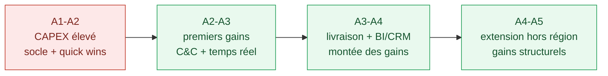

# Estimation chiffrée — Transformation du SI : M. Traiteur

> **Commanditaire** : Direction M. Traiteur (M. Traiteur père & fils)
> **Maîtrise d'ouvrage déléguée / AMOA** : équipe projet SI
> **Objet** : Estimation des coûts et bénéfices attendus (grandes lignes) de la transformation du SI
> **Version** : 1.0 — document de cadrage

---

## 1. Avertissement méthodologique

L'énoncé du cas ne fournit que les **coûts du SI actuel**. Les montants de transformation ci-dessous sont des **hypothèses de cadrage** (ordres de grandeur PME), explicitement signalées, à affiner par appel d'offres et à arbitrer en comité de pilotage. L'objectif est de poser une **logique économique** (CAPEX / OPEX / gains / ROI), pas un budget contractuel.

Données certaines (SI actuel) :

| Composant | Coût actuel |
|---|---|
| ERP infogéré (10 postes) | 16 000 € HT/an |
| Caisses (par caisse) | 5 000 €/an |
| TPE | inclus franchise |
| Site web + app | 1 500 €/an |
| Logistique « Je livre » | 150 000 €/an |

---

## 2. Investissements (CAPEX) — hypothèses

| Lot | Nature | Estimation (hyp.) |
|---|---|---|
| Audit + cahier des charges ERP | Conseil / AMOA | 15 000 – 25 000 € |
| Mise en œuvre & intégration ERP SaaS | Paramétrage, reprise de données, API | 80 000 – 150 000 € |
| Connecteur caisses ↔ socle (temps réel) | Middleware / dev | 20 000 – 40 000 € |
| Module facturation 8 % du CA | Dev / paramétrage | 15 000 – 30 000 € |
| Refonte site + application | Conception, dev, recette | 60 000 – 120 000 € |
| Click & collect accéléré | Module + intégration | 15 000 – 30 000 € |
| Intégration logistique nationale & multi-prestataires | API / orchestration | 30 000 – 60 000 € |
| Livraison à domicile | Intégration partenaire, parcours | 20 000 – 40 000 € |
| BI & tableaux de bord | Mise en place | 15 000 – 30 000 € |
| CRM & fidélité | Mise en place, conformité RGPD | 20 000 – 40 000 € |
| Kit onboarding SI franchisé | Industrialisation | 10 000 – 20 000 € |
| Sécurité (IAM/MFA, PRA, RGPD) | Mise en conformité | 25 000 – 50 000 € |
| Conduite du changement & formation | Réseau (25+ franchisés) | 30 000 – 60 000 € |
| **Total CAPEX (sur 5 ans)** | | **≈ 355 000 – 695 000 €** |

> Fourchette large assumée : elle dépend du recours à des briques **open source** (bas de fourchette) vs éditeurs propriétaires (haut de fourchette), et de l'internalisation d'une partie des développements.

---

## 3. Coûts de fonctionnement (OPEX) — cible vs actuel

| Poste | OPEX actuel | OPEX cible (hyp.) | Tendance |
|---|---|---|---|
| Socle ERP | 16 000 €/an | 15 000 – 25 000 €/an (SaaS, périmètre élargi) | ≈ stable |
| Site / app / e-commerce | 1 500 €/an | 8 000 – 15 000 €/an (plateforme refondue, trafic accru) | ↑ |
| Logistique | 150 000 €/an (mono-régional) | modèle au CA / multi-prestataires (à négocier) | à arbitrer |
| BI / CRM | — | 6 000 – 12 000 €/an | nouveau |
| Sécurité / sauvegarde / PRA | — | 8 000 – 15 000 €/an | nouveau |
| Hébergement cloud | inclus | 6 000 – 12 000 €/an | nouveau / refacturé |

> **Principe directeur** : l'OPEX du **socle** doit rester stable ou baisser ; les OPEX nouveaux (BI, CRM, sécurité) sont **gagés sur la croissance du CA** et sur la marge des nouveaux services.

---

## 4. Bénéfices et gains attendus

| Levier | Mécanisme de gain | Objectif servi |
|---|---|---|
| **Click & collect accéléré** | Hausse des ventes du déjeuner (aujourd'hui ~10 % du CA) | O6, O1 |
| **Livraison à domicile (semaine)** | Nouveau canal de CA, panier additionnel | O4, O1 |
| **Temps réel + facturation 8 %** | Recettes siège indexées sur le CA réseau (vs frais fixes) ; fin des écarts batch | O5, O1 |
| **Extension hors région** | Nouveaux franchisés (≈ 600 k€ CA/an chacun après 2 ans) | O2, O1 |
| **Pilotage BI / CRM** | Moins de pertes, meilleure marge, fidélisation | O1 |
| **Découplage / réversibilité** | Baisse du coût de changement de prestataire, fin du verrouillage éditeur | O3, O7 |
| **Sobriété & mutualisation** | Réduction des doubles saisies, optimisation des tournées | transverse |

**Effet de levier majeur sur le modèle de recettes** : le passage de frais fixes (3 000 €/mois = 36 000 €/an/franchisé) à un modèle **indexé 8 % du CA** signifie qu'un franchisé à 600 000 € de CA génère ≈ **48 000 €/an** de frais — soit un alignement des recettes du siège sur la croissance réelle du réseau (hypothèse pour les nouveaux contrats).

---

## 5. Retour sur investissement (logique)

- **Horizon** : le CAPEX est étalé sur 5 ans, en phase avec la feuille de route ; les premiers gains (C&C, livraison) arrivent dès les années 1-2.
- **Seuil de rentabilité** : l'investissement est gagé sur (a) l'augmentation du CA des nouveaux services, (b) les recettes indexées 8 % et (c) l'ouverture de franchises hors région. **Quelques nouveaux franchisés et la progression des ventes déjeuner/livraison suffisent à couvrir le CAPEX** sur l'horizon.
- **Objectif structurant** : doublement du CA (O1). La transformation SI est le **rendez-vous obligé** de cet objectif — sans temps réel, sans logistique nationale et sans nouveaux canaux, la cible de CA n'est pas atteignable.

---

## 6. Recommandations budgétaires

1. **Étaler le CAPEX** par lot et conditionner chaque lancement à un jalon go/no-go (comité de pilotage trimestriel).
2. **Privilégier le SaaS et l'open source** sur le socle pour contenir l'OPEX et éviter le re-verrouillage éditeur.
3. **Renégocier la logistique** dans une logique multi-prestataires / au CA, plutôt qu'un forfait fixe mono-régional.
4. **Suivre les KPI financiers** : OPEX socle, part du CA déjeuner, CA des nouveaux canaux, recettes indexées 8 %, progression vers le CA × 2.

> Ce chiffrage reste une vue de cadrage. Le budget détaillé sera consolidé après appels d'offres et arbitré en comité de pilotage, en cohérence avec le schéma directeur et l'analyse des risques.
